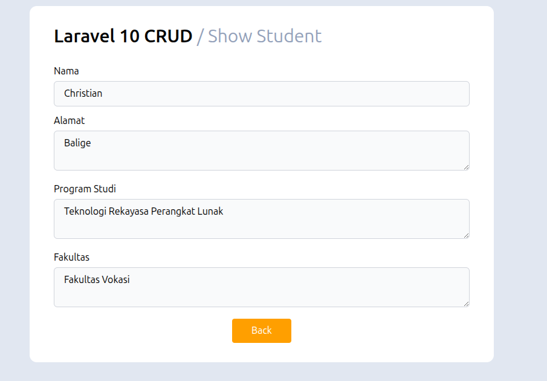

<!-- ABOUT THE PROJECT -->
## CRUD Exercise in Laravel 11


Proyek ini adalah sebuah aplikasi web full-stack sederhana yang dibangun untuk mempraktikkan dan mendalami konsep dasar Laravel 11. 

Fokus:
* RUD (Create, Read, Update, Delete) untuk manajemen data mahasiswa
* Relasi Mahasiswa ke data program studi dan fakultas
* Arsitektur MVC (Model, View, Controller)

Untuk database MySQL dan PhpMyAdmin akan dijalankan di dalam Docker, konfigurasi dapat dilihat pada file `docker-compose.yaml`. Interface proyek ini menggunakan Tailwind CSS yang di-bundle melalui Vite.

### Built With

[]()

<!-- GETTING STARTED -->
## Getting Started

Panduan ini akan membantu Anda menjalankan salinan proyek ini di mesin lokal Anda.

### Prerequisites

Sebelum memulai, pastikan Anda telah menginstal perangkat lunak berikut di sistem Anda.

* PHP 8.2 atau lebih tinggi

* Composer ([Cara Install](https://getcomposer.org/doc/00-intro.md))

* Node.js dan NPM ([Cara Install](https://nodejs.org/en/download))

* Docker ([Cara Install](https://docs.docker.com/engine/install/)) -> opsional, kalian bisa pakai XAMPP/Laragon (Case ku karena pakai Ubuntu, jadi tidak perlu install server apache lagi)


### Installation

Ikuti langkah-langkah di bawah ini untuk menginstal dan menjalankan aplikasi. (Langkah yang ditampilkan tidak harus dilakukan secara berurutan, feel free untuk melakukan trial and error).

1. Clone repository
   ```sh
   git clone https://github.com/bluga404/crud-exercise
   ```
3. Masuk ke direktori project
   ```sh
   cd crud-exercise
   ```
4. Buat file .env Anda dengan menyalin dari file contoh
   ```js
   cp .env.example .env
   ```
5. Jalankan container Docker (opsional)
   ```sh
   docker compose up -d
   ```
6. Install dependensi PHP via Composer
   ```sh
   composer install
   ```
7. Generate kunci aplikasi Laravel
   ```sh
   php artisan key:generate
   ```
8. Jalankan migrasi database
   ```sh
   php artisan migrate
   ```
5. Setup Tailwind CSS
   ```sh
   https://tailwindcss.com/docs/installation/using-vite
   ```

<!-- USAGE EXAMPLES -->
## Usage

Setelah instalasi selesai, Anda perlu menjalankan dua server pengembangan secara bersamaan di dua terminal terpisah.

1. Jalankan Vite Development Server
   ```sh
   npm run dev
   ```
2. Jalankan Laravel Development Server
   ```sh
   php artisan serve
   ```

_Untuk mengetahui alurnya lebih dalam, please refer dan pelajari ke code-nya langsung_
_Happy Coding!_


<!-- FEATURES -->
## FEATURES
1. Home

2. Add Student

3. Edit Student

4. Show Student


<!-- LICENSE -->
## License

Tidak ada license, feel free once again to modify :).